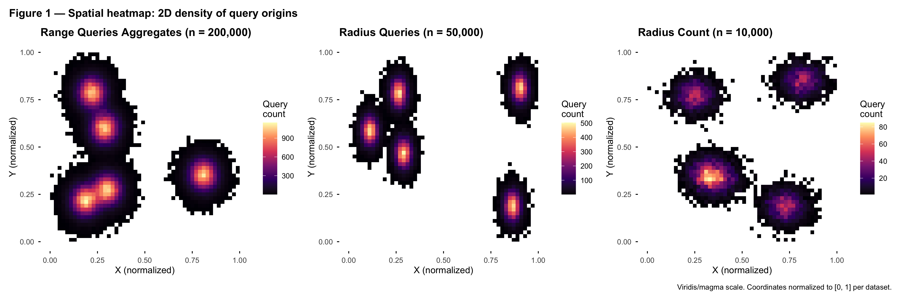
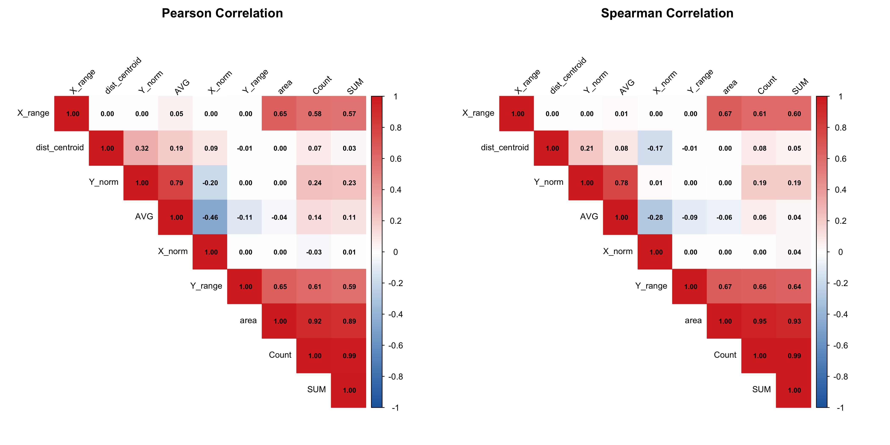
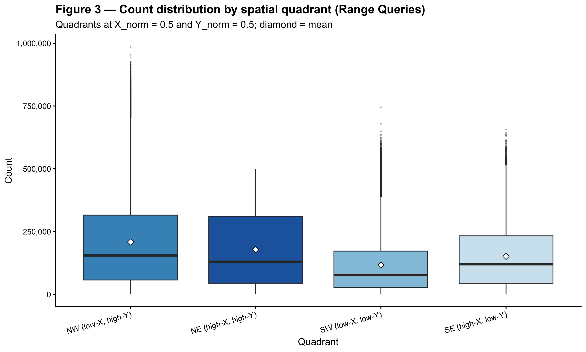
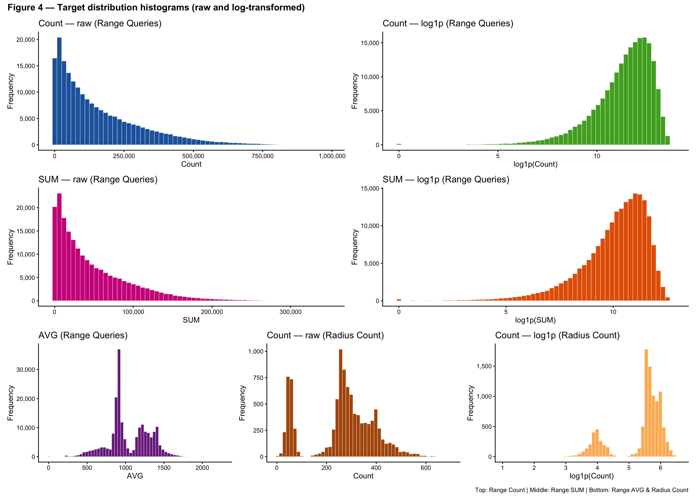
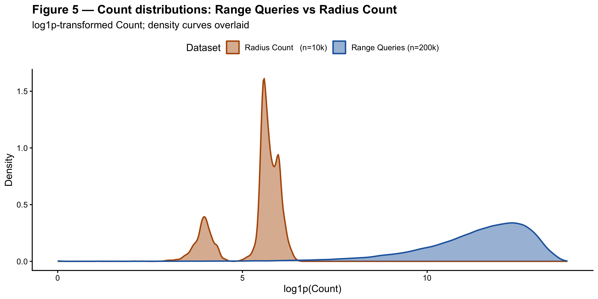
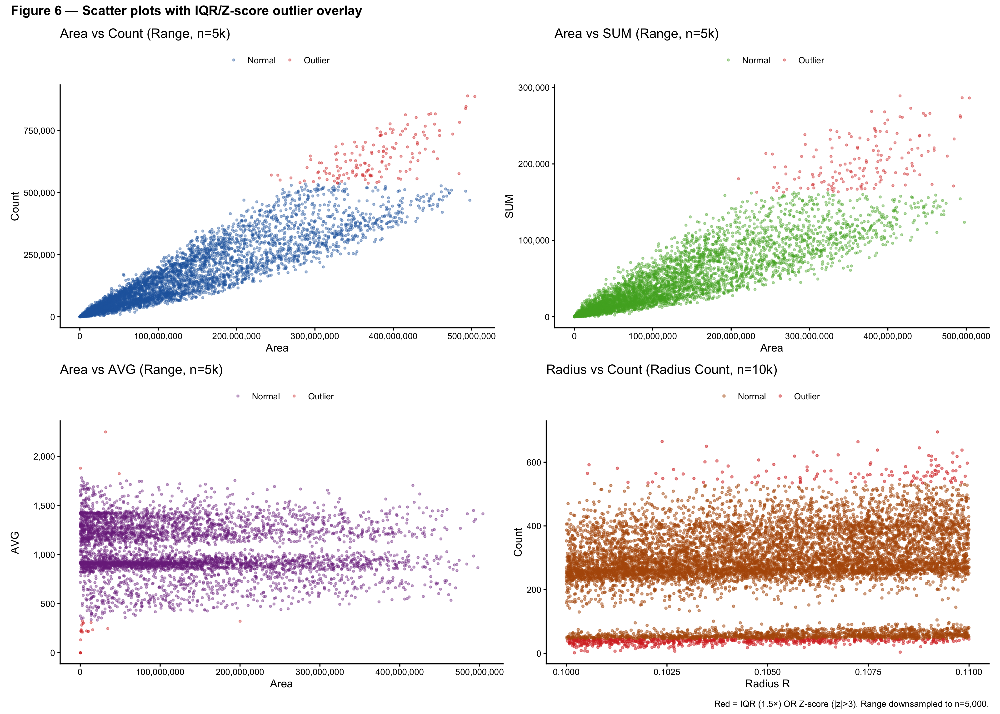
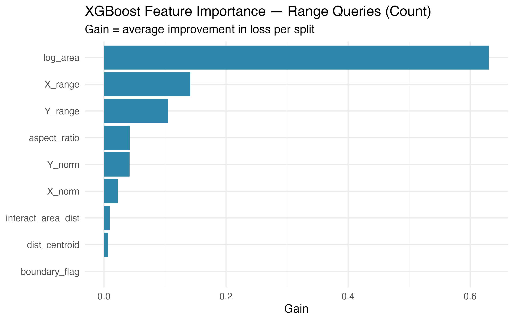
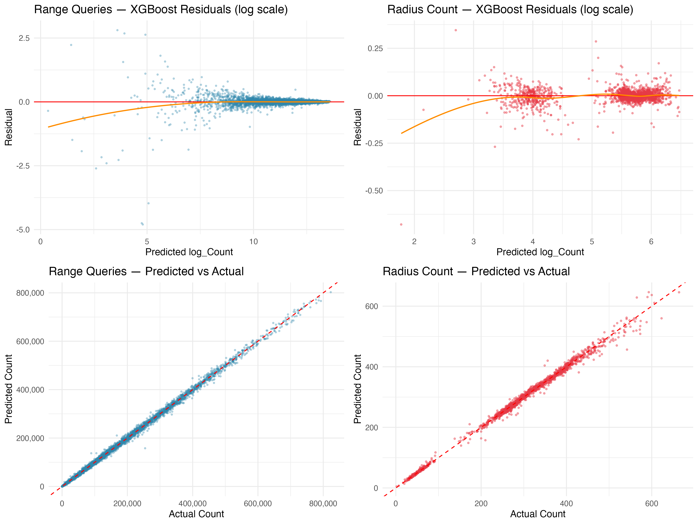
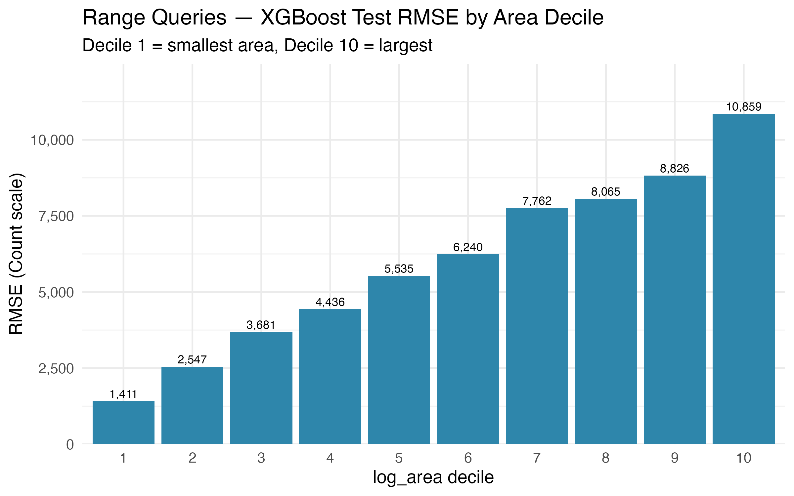
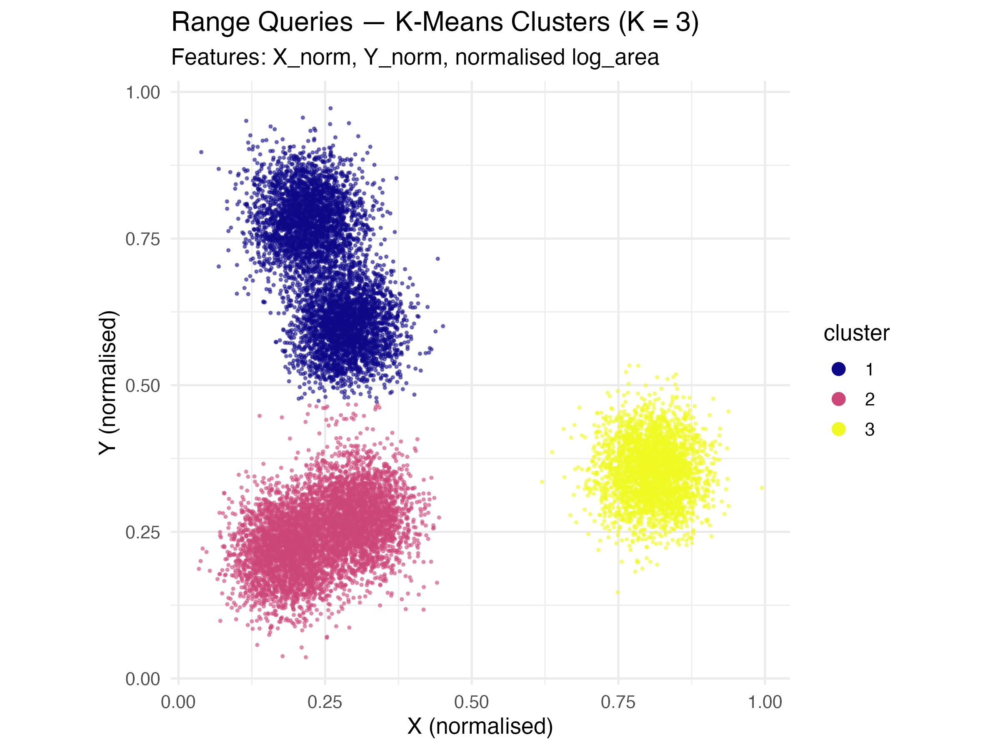

```{r setup, include=FALSE}
knitr::opts_chunk$set(
  echo       = FALSE,
  message    = FALSE,
  warning    = FALSE,
  fig.pos    = "H",
  out.width  = "\\linewidth"
)
```

```{r abstract, child="sections/01_abstract.md"}
```

```{r overview, child="sections/02_overview.md"}
```

```{r data-processing, child="sections/03_data_processing.md"}
```

```{r fig01, fig.cap="Range-query target distributions before and after log-transform; the log scale substantially reduces skewness for both Count and SUM."}

```

```{r fig02, fig.cap="Spearman correlation matrix for Range Queries — area dominates Count (\\(\\rho = 0.95\\))."}

```

```{r data-analysis, child="sections/04_data_analysis.md"}
```

```{r fig03, fig.cap="Spatial heat-map of mean Count across the Chicago bounding box; strong north–south structure."}

```

```{r fig04, fig.cap="Boundary-crossing prevalence across the three sub-datasets — 99.9\\% of radius queries cross the bounding box."}

```

```{r fig05, fig.cap="Per-feature distribution after preprocessing — engineered features are well-conditioned for regression."}

```

```{r fig06, fig.cap="A representative sample of the 200{,}000 range query rectangles overlaid on the city bounding box."}

```

```{r model-training, child="sections/05_model_training.md"}
```

```{r fig07, fig.cap="XGBoost feature importance (Gain) — Range Queries.", out.width="0.9\\linewidth"}

```

```{r model-validation, child="sections/06_model_validation.md"}
```

```{r fig08, fig.cap="XGBoost residual diagnostics: log-scale residuals (top) and predicted-vs-actual (bottom) for Range and Radius test sets."}

```

```{r fig09, fig.cap="Per-decile XGBoost test RMSE (Range Queries) — error rises monotonically with \\texttt{log\\_area}.", out.width="0.95\\linewidth"}

```

```{r fig10, fig.cap="K-Means clusters (K\\(^*\\) = 3 by silhouette) on Range Queries spatial features."}

```

```{r model-performance, child="sections/07_model_performance.md"}
```

```{r conclusion, child="sections/08_conclusion.md"}
```

```{r data-sources, child="sections/09_data_sources.md"}
```

```{r source-code, child="sections/10_source_code.md"}
```

```{r bibliography, child="sections/11_bibliography.md"}
```
